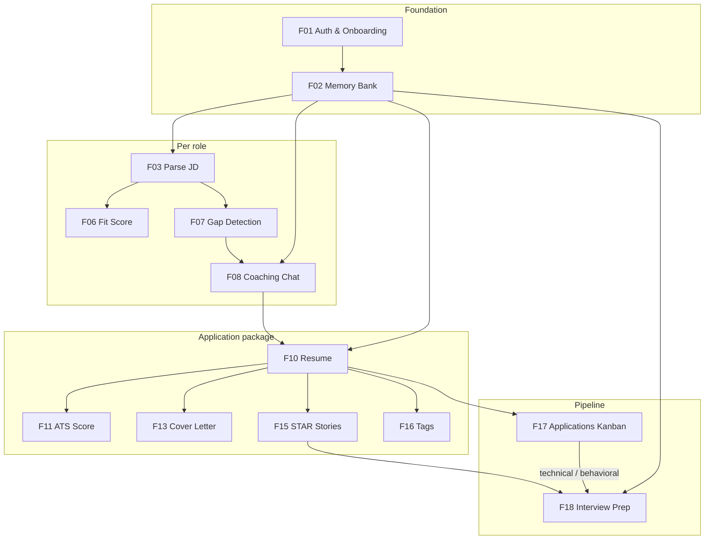

# Aprise — AI Career Coach

> A personalized AI system that turns any job description into a coached, tailored resume and cover letter — and tracks your entire application pipeline.

This document is written for developers new to the codebase. It explains **what** every piece does, **why** it was built the way it was, and **how** to get it running.

---

## Table of Contents

1. [What the product does](#1-what-the-product-does)
2. [Repository layout](#2-repository-layout)
3. [Tech stack and why](#3-tech-stack-and-why)
4. [Database schema](#4-database-schema)
5. [Feature deep-dives](#5-feature-deep-dives)
   - [Authentication and onboarding](#51-authentication-and-onboarding)
   - [Document ingestion and memory](#52-document-ingestion-and-memory)
   - [Job description processing](#53-job-description-processing)
   - [AI coaching — the LangGraph loop](#54-ai-coaching--the-langgraph-loop)
   - [Resume generation](#55-resume-generation)
   - [Cover letter generation](#56-cover-letter-generation)
   - [STAR story library](#57-star-story-library)
   - [Fit and ATS scoring](#58-fit-and-ats-scoring)
   - [Application tracking](#59-application-tracking)
   - [Tag-based browser](#510-tag-based-browser)
   - [Intelligence layer](#511-intelligence-layer)
6. [Product roadmap](#6-product-roadmap)
7. [Key design decisions](#7-key-design-decisions)
8. [Observability](#8-observability)
9. [Security](#9-security)
10. [Running locally](#10-running-locally)
11. [Environment variables](#11-environment-variables)
12. [API reference](#12-api-reference)
13. [Migrations](#13-migrations)
14. [What is not built yet](#14-what-is-not-built-yet)

---

## 1. What the product does

A user uploads their CV. They paste in a job description (JD). The app then:

1. **Extracts** structured information from both documents — skills, experience, responsibilities.
2. **Identifies gaps** — what the JD asks for that the user hasn't clearly demonstrated.
3. **Coaches** the user through those gaps in a conversation — one question at a time, drawing out real experiences and stories.
4. **Generates** a fully tailored, ATS-friendly resume and cover letter using everything learned.
5. **Saves** the best stories as a STAR library for future interviews.
6. **Tracks** the application in a Kanban board from applied → offer/rejected.
7. **Preps** the user for interviews once an application moves into the interview stages.

The AI coach also:
- Researches the company automatically using live web search (Tavily).
- Remembers what you tell it — across all future sessions, not just the current one.
- Surfaces relevant past applications when you apply to a similar role.
- Scores your resume for ATS keyword coverage and flags formatting issues.
- Scores overall fit so you can prioritise which roles to pursue.

---

## 2. Repository layout

```
aprise/
├── api/                        # Backend (Python / FastAPI)
│   ├── index.py                # App entry point, middleware, global error handlers
│   ├── db/
│   │   ├── models.py           # All SQLAlchemy ORM models
│   │   └── neon.py             # Database engine and session factory
│   ├── routers/                # HTTP layer — one file per resource
│   │   ├── auth.py             # JWT verification via Clerk JWKS
│   │   ├── profile.py          # User profile CRUD
│   │   ├── document.py         # File upload metadata
│   │   ├── memory.py           # CV ingest → memory extraction; manual CRUD + search
│   │   ├── jd.py               # Job description parsing, fit score, notes
│   │   ├── conversation.py     # Coaching chat (SSE streaming); interview prep trigger
│   │   ├── resume.py           # Resume generation, ATS score, DOCX/PDF download
│   │   ├── cover_letter.py     # Cover letter generation and PDF download
│   │   ├── application.py      # Application tracking (Kanban)
│   │   ├── star.py             # STAR story library
│   │   └── tags.py             # Tag cloud and tag-based browse
│   ├── services/               # Business logic — no HTTP here
│   │   ├── ai_service.py           # Unified LLM + embedding client (singleton)
│   │   ├── memory_service.py       # Document parsing and memory chunking
│   │   ├── jd_service.py           # JD parsing, embedding, enrichment
│   │   ├── gap_detection_service.py # Gap analysis before conversation starts
│   │   ├── conversation_service.py  # Routing, state, message persistence (SSE)
│   │   ├── conversation_graph.py    # LangGraph coaching graph definition
│   │   ├── resume_service.py        # Resume generation, ATS scoring, PDF export
│   │   ├── cover_letter_service.py  # Cover letter generation and PDF export
│   │   ├── star_service.py          # STAR story extraction and retrieval
│   │   ├── application_service.py   # Application CRUD and status transitions
│   │   ├── company_research_service.py  # Tavily web search
│   │   ├── jd_similarity_service.py     # pgvector similarity across past JDs
│   │   ├── profile_service.py       # Profile management
│   │   ├── injection_defense_service.py # Prompt injection detection
│   │   └── utils.py                 # Shared helpers
│   ├── prompts/                # LLM prompt definitions (15 prompts)
│   │   ├── __init__.py             # BasePromptCatalog, TextPromptCatalog, singletons
│   │   ├── jd_parsing.py
│   │   ├── gap_detection.py
│   │   ├── conversation_response.py
│   │   ├── interview_coaching.py
│   │   ├── resume_drafting.py
│   │   ├── resume_generation.py
│   │   ├── cover_letter_generation.py
│   │   ├── memory_extraction.py
│   │   ├── memory_promotion.py
│   │   ├── extract_answer.py
│   │   └── resume_transition.py
│   ├── evals/
│   │   └── test_conversation_graph.py  # Offline graph tests
│   └── pyproject.toml
├── app/                        # Frontend (Next.js 16 / React 19)
│   ├── layout.tsx              # Root layout with Clerk provider
│   ├── page.tsx                # Marketing landing page
│   ├── onboarding/page.tsx     # First-time profile setup (4 steps)
│   ├── sign-in/, sign-up/      # Clerk-hosted auth pages
│   └── app/
│       ├── layout.tsx          # Authenticated shell (nav, sidebar)
│       ├── page.tsx            # Redirects to /app/chat
│       ├── chat/page.tsx       # Main coaching workspace (JD input, chat, panels)
│       ├── applications/page.tsx # Kanban board
│       ├── files/page.tsx      # Uploaded documents and memory cards
│       ├── browse/page.tsx     # Tag-based JD and resume browser
│       ├── stars/page.tsx      # STAR story library
│       └── error.tsx           # Error boundary
├── lib/
│   ├── api.ts                  # Typed TypeScript client for all backend endpoints
│   └── utils.ts                # cn() helper
├── components/ui/              # shadcn/ui components (button, badge, card, …)
├── migrations/                 # Alembic database migrations (12 versions)
├── docker/                     # api.Dockerfile, web.Dockerfile
├── docker-compose.yml
├── middleware.ts               # Clerk auth middleware
├── next.config.ts              # API rewrites, Sentry, 2-min proxy timeout
├── vercel.json                 # Vercel API routing (Python serverless)
├── instrumentation.ts          # Sentry registration
└── .env.local                  # Local secrets (never committed)
```

---

## 3. Tech stack and why

### Backend — FastAPI (Python)

**Why FastAPI over Django/Flask?**
FastAPI was chosen for three reasons:
- **Async-native** — LLM calls, embeddings, and Tavily searches all benefit from non-blocking I/O.
- **Automatic OpenAPI docs** — every route is self-documenting at `/docs` with no extra work.
- **Pydantic-first** — request/response validation is declarative and composable; the same Pydantic models are reused for LLM structured output.

### Frontend — Next.js 16 (App Router) + React 19

**Why Next.js?**
- The App Router's server components reduce the JavaScript shipped to the browser.
- API routes can be deployed as Vercel serverless functions alongside the frontend.
- Clerk's Next.js SDK integrates in one middleware line.

### Database — Neon Postgres + pgvector

**Why Postgres?**
Every piece of data in this app — memories, JDs, conversations, resumes, applications — is relational. Postgres handles structured data, foreign keys, JSONB for semi-structured fields, and vector search in one engine.

**Why Neon?**
Neon is serverless Postgres. It scales to zero when there are no connections (zero cost at rest), and uses pgbouncer for connection pooling by default — important because serverless functions don't maintain persistent connections.

**Why pgvector?**
Semantic search (finding memories relevant to a question, finding similar past JDs, retrieving STAR stories) requires comparing 1536-dimensional float vectors. pgvector adds a native `vector` column type and distance operators (`<=>` for cosine distance) directly to Postgres. This avoids running a separate vector database (Pinecone, Weaviate, etc.) — one less service to operate, and vectors live next to the data they describe.

**Why HNSW indexes?**
Without an index, a vector search scans every row in the table (`O(n)`). HNSW (Hierarchical Navigable Small World) is an approximate nearest-neighbour index that makes searches `O(log n)`. It was chosen over IVFFlat because it doesn't require a training step — it builds incrementally as rows are inserted. The tradeoff is slightly higher memory usage, which is acceptable given the volume.

### AI — LangChain + LangGraph + OpenAI

**Why LangChain?**
LangChain 1.x provides `create_agent` — a unified way to call any LLM (OpenAI, Anthropic, etc.) with structured output, tool calling, and middleware. It also provides the `ModelFallbackMiddleware` which automatically retries with a cheaper fallback model if the primary model fails. Without LangChain, you'd write this retry/fallback logic yourself for every LLM call.

**Why LangGraph?**
The coaching conversation is not a simple request/response — it has state (which gaps remain), branches (coaching mode vs. resume-drafting mode vs. interview prep mode), and multiple nodes that must run in sequence. LangGraph models this as a directed graph with explicit state, making the flow inspectable, testable, and easy to extend. Think of it as a state machine backed by an LLM.

**Why OpenAI?**
`text-embedding-3-small` produces 1536-dimensional embeddings that are compact and fast. The gpt-5 model family is used for reasoning tasks; gpt-5-nano is used for cheap operations like answer extraction. Having different models per prompt type lets us control cost precisely.

### Auth — Clerk

**Why Clerk over building auth yourself?**
Auth is one of the most security-sensitive parts of any app. Clerk handles email/password, OAuth, MFA, session management, and JWKS key rotation. The backend verifies tokens by fetching Clerk's JWKS endpoint (cached), never by storing session tokens itself. This means no auth state in the database.

### Company research — Tavily

**Why Tavily over raw Google/Bing search?**
Tavily is a search API designed specifically for LLM pipelines. It returns clean, structured snippets and an AI-generated summary (`include_answer=True`) without requiring you to scrape, parse HTML, or deal with CAPTCHAs. The `langchain-tavily` package (the official 2025+ integration — not the deprecated `langchain_community` version) plugs directly into the LangChain ecosystem.

### Observability — Sentry + LangSmith

**Sentry** catches every unhandled exception in both the frontend (JavaScript) and backend (Python), with separate projects so frontend noise doesn't pollute backend alerts. The FastAPI, SQLAlchemy, and logging integrations are all enabled so database errors and log-level errors are also captured.

**LangSmith** traces every LLM call — prompt, response, latency, token count — so you can debug coaching quality without adding print statements. Every `create_agent` call is tagged with the conversation ID, user ID, and JD ID so you can find the exact trace for a user-reported bug.

---

## 4. Database schema

```
profiles          — one row per user; holds name, target roles, experience years
  │
  ├─ documents    — uploaded files (CV, LinkedIn PDF); tracks extraction status
  │
  ├─ memories     — extracted chunks from documents; each has a 1536-dim embedding
  │                 chunk_type: EXPERIENCE | EDUCATION | SKILLS_SUMMARY | PROJECTS
  │                             LANGUAGES | WAR_STORY | PREFERENCE | OTHER
  │
  ├─ star_stories — STAR-format interview stories, each with a 1536-dim embedding
  │                 auto-extracted after resume generation; browsable by skill tag
  │
  ├─ jds          — job descriptions; parsed_requirements and labels stored as JSONB
  │    │            labels: { company_size, role_focus, tech_depth, domain, tags[] }
  │    │            company_research: plain text summary from Tavily (nullable)
  │    │
  │    ├─ jd_memories    — full JD text embedded as a vector chunk (for similarity search)
  │    │
  │    ├─ jd_notes       — user-authored notes per JD (NOTE | WAR_STORY | WORRY)
  │    │
  │    ├─ conversations   — one conversation per JD (enforced by unique constraint)
  │    │    │  state: JSONB { gaps, questions_asked, answers, questions_remaining }
  │    │    │  current_step: jd_parsing → gap_detection → gap_conversation
  │    │    │                → resume_generation → interview_prep → done
  │    │    └─ conversation_messages   — every chat turn, role: user | assistant
  │    │
  │    ├─ resumes         — generated resume content stored as JSONB
  │    │    │  content: { summary, experience: [{company,role,dates,bullets}], skills }
  │    │    │  labels: copy of JD labels + generated retrieval tags
  │    │    └─ (docx_content: bytes, for server-side PDF via reportlab)
  │    │
  │    └─ cover_letters   — generated cover letter content stored as JSONB
  │         content: { opening, body_paragraphs[], closing, signature }
  │
  └─ applications  — one per JD; status tracks pipeline stage
                     status: applied → screening → technical → behavioral
                             → offer | rejected
                     denormalized: company_name, role_title (survives JD deletion)
```

**Why JSONB for `parsed_requirements`, `labels`, `state`, and `content`?**

These fields are semi-structured — their shape is known but evolves as the product does. JSONB lets us store them without schema migrations every time we add a field, and Postgres's GIN indexes make them efficiently queryable. For example, `labels["role_focus"]` can be indexed and filtered directly.

**Why store `company_name` and `role_title` on `applications` (denormalised)?**

The Kanban board displays applications even after a JD might be deleted. Denormalising these two display fields onto the `applications` row means the Kanban always has something to show — even in edge cases — without a JOIN.

---

## 5. Feature deep-dives

### 5.1 Authentication and onboarding

**Files:** `api/routers/auth.py`, `app/onboarding/page.tsx`, `middleware.ts`

Every protected endpoint calls `Depends(get_current_user)`. This dependency:

1. Extracts the `Authorization: Bearer <token>` header.
2. Fetches Clerk's JWKS (JSON Web Key Set) endpoint — the public keys used to verify JWTs. The result is cached with `@lru_cache` so we don't make an HTTP call on every request.
3. Decodes the JWT using `PyJWT`, verifying the signature, expiry, and issuer.
4. Returns the Clerk `user_id` string (looks like `user_2abc...`).

If the JWKS endpoint is unreachable, the app returns 503 (Service Unavailable) rather than 401. This is intentional — a 401 would imply the token is invalid when the real problem is a network issue.

**Onboarding** (`/onboarding`) is a 4-step flow — name, experience level, target roles, CV upload — that runs before any other page is accessible. The authenticated app shell in `app/app/layout.tsx` checks `GET /api/profiles/me`; a 404 response means the profile hasn't been created yet and redirects to onboarding. This is the entry point that feeds the memory system: the CV uploaded here is the first input to the RAG pipeline.

---

### 5.2 Document ingestion and memory

**Files:** `api/routers/memory.py`, `api/services/memory_service.py`, `api/prompts/memory_extraction.py`, `api/prompts/memory_promotion.py`

**The flow:**

```
User uploads PDF
  → validate file type (content-type + extension check)
  → extract text with pypdf
  → scan for prompt injection (InjectionDefenseService)
  → call LLM: MemoryExtractionPrompt
      → returns list of { chunk_type, content } objects
  → embed each chunk with text-embedding-3-small (1536 dims)
  → write chunks + embeddings to memories table in one transaction
  → write a Document row (for the files page)
```

**Why chunk by semantic type rather than fixed-size windows?**

Most RAG systems split documents into 512-token chunks arbitrarily. This loses context — a chunk about Python skills might start mid-sentence and end before listing the frameworks. Our LLM extraction prompt instead asks the model to identify coherent semantic units: a full work experience entry, a full education entry, a project description. Each chunk makes sense on its own and can be retrieved individually. The `chunk_type` label also lets the coaching prompts weight different memory types differently (e.g., WAR_STORY chunks are highly relevant for gap-filling).

**Memory promotion during coaching:**

When a user shares something new in the coaching conversation (an experience, a preference, a skill), the `promote_memory_node` in the LangGraph graph can extract that as a new memory and write it to the database. This means the coach gets smarter over time — information shared in one job application's conversation is available in all future ones.

The memory system is the foundation that every other feature builds on. Memories are retrieved at coaching time, resume generation time, STAR story extraction time, and fit-scoring time.

---

### 5.3 Job description processing

**Files:** `api/routers/jd.py`, `api/services/jd_service.py`, `api/prompts/jd_parsing.py`, `api/services/company_research_service.py`

**The flow:**

```
User pastes JD text
  → JDService.create_jd()
      Phase 1 (single transaction):
        → flush JD row (get ID before LLM call)
        → LLM: JDParsingPrompt → structured output:
            company_name, role_title, parsed_requirements, labels
        → embed full JD text → write JDMemory row
        → commit (JD + JDMemory in one atomic write)
      Phase 2 (separate transaction, best-effort):
        → CompanyResearchService.research()
            → TavilySearch (search_depth="basic", include_answer=True)
            → returns 2-4 sentence company summary
        → write company_research to JD row
        → commit
```

**Why two separate transactions?**

Phase 1 (parse + embed) is essential — if it fails, nothing is saved and the user gets an error. Phase 2 (company research) is enrichment — if Tavily is down or the API key is missing, the JD was already saved and the user can continue. A single transaction would roll back the entire JD creation if Tavily returned an error. The two-phase design makes the enrichment a "nice to have" that can never break the core flow.

**What `labels` contain:**

The JD parsing prompt extracts four labels from every JD:
- `company_size`: startup | scaleup | enterprise
- `role_focus`: engineering | product | design | leadership | other
- `tech_depth`: high | medium | low
- `domain`: fintech | healthtech | SaaS | etc.

These labels drive coaching calibration, resume similarity search, and tag-based browsing. They also determine how gap severity is assessed — a `tech_depth=high` JD means technical gaps matter more than a `role_focus=product` JD.

---

### 5.4 AI coaching — the LangGraph loop

**Files:** `api/services/conversation_graph.py`, `api/services/conversation_service.py`, `api/services/gap_detection_service.py`, `api/prompts/gap_detection.py`, `api/prompts/conversation_response.py`, `api/prompts/resume_drafting.py`, `api/prompts/interview_coaching.py`

This is the heart of the product.

#### Gap detection (happens once, when the conversation is created)

```
GapDetectionService.detect(jd, profile)
  → embed required_skills + responsibilities
  → semantic search: top memories relevant to this JD
  → JDSimilarityService.find_similar() → top 3 past JDs by vector similarity
  → LLM: GapDetectionPrompt
      inputs: required_skills, responsibilities, user_memories,
              company_research, similar_jd_context, JD labels
      outputs: { gaps: list[str], opening_message: str, questions_remaining: int }
  → write conversation row with initial state
  → write opening_message as the first assistant ConversationMessage
```

The gap detection prompt is instructed to calibrate gap severity using the JD labels. A missing skill in a `tech_depth=high` JD is flagged as a critical gap; the same missing skill in a `role_focus=product` JD might be a minor gap.

#### The LangGraph graph structure

```
START
  │
  ▼
route_node          ← decides which node runs based on conversation.current_step
  │
  ├─→ gap_conversation_node    (step = gap_conversation)
  │       │
  │       └─→ extract_answer_node  ← pulls structured answer from user message
  │               │
  │               └─→ promote_memory_node  ← maybe saves new memory to DB
  │
  ├─→ resume_drafting_node     (step = resume_generation)
  │
  ├─→ interview_coaching_node  (step = interview_prep)
  │
  └─→ resume_transition_node   (when all gaps resolved)
          │
          └─→ END (sets step = resume_generation)
```

**Why LangGraph instead of a simple if/else chain?**

The coaching loop needs explicit state (which gaps remain), branching (are there still gaps?), and sequential node execution. LangGraph models this as a directed graph with typed state (`CoachingState` TypedDict). Each node is a pure function: it reads from state, calls the LLM, and writes back to state. No side effects inside the graph — all database writes happen in `conversation_service.py` after the graph returns.

This separation matters for testing: you can test the graph logic without a database by passing mock state directly to `coaching_graph.invoke()`.

**Why stateless graph (no checkpointer)?**

LangGraph supports checkpointers (Redis, Postgres) that save graph state between turns. We deliberately don't use one. All durable state lives in the `conversations.state` JSONB column, managed by `conversation_service.py`. This keeps the graph stateless and side-effect-free, which makes it easier to reason about and test. The service layer is the source of truth, not the graph.

#### What happens on every coaching message

```
ConversationService.stream_message(conversation_id, content)
  1. Load conversation + messages (eagerly, to avoid N+1 queries later)
  2. Create and COMMIT user message — so it's never lost if LLM fails
  3. Batch embed [coaching_query, content] in ONE round-trip (halves embedding latency)
  4. Retrieve top-10 relevant memories by vector (for coaching context)
  5. Retrieve top-8 nearby memories by vector (for deduplication context)
  6. Build CoachingState from DB state + retrieved context
  7. coaching_graph.invoke(state) in a thread → streams tokens via SSE bridge queue
  8. Persist: assistant message + updated conversation state + promoted memories
  9. Emit `done` with current_step and memory_updates
  10. Stream events back to the client via SSE (see below)
```

**SSE streaming:** The `/conversations/{id}/messages` endpoint streams coaching turns as Server-Sent Events. The frontend reads the stream via a `ReadableStream` in `lib/api.ts`.

| Event | When | Payload |
|---|---|---|
| `thinking` | Before and during graph execution | `{ type, phase }` — e.g. "Searching your memory bank…", "Checking which gaps you addressed…" |
| `token` | LLM streaming | `{ type, content }` — one fragment of the assistant reply |
| `done` | Turn complete | `{ type, message_id, content, current_step, promoted_memories, memory_updates[] }` |
| `error` | Failure | `{ type, detail }` |

**Thinking phases** fire from two places: `ConversationService.stream_message()` (memory retrieval, gap analysis setup) and individual LangGraph nodes via `_put_thinking()` / `_stream_text()` (answer extraction, memory promotion, coaching generation). The chat UI shows the latest phase in the streaming bubble until the first token arrives.

**Step transitions:** The `done` event includes `current_step`. When all gaps are resolved, the backend sets `resume_generation` and the frontend updates the badge (Coaching → Resume ready), auto-opens the **Resume** tab, and shows an inline system card pointing the user to generate their resume.

**In-chat system updates:** When memories are promoted, the `done` event includes `memory_updates[]` (content preview + `chunk_type`). The chat renders cards linking to **Files**. After resume generation, STAR extraction count is shown with a link to **STAR Library**. **Mark as applied** shows a card linking to **Applications**.

**Composer UX:** The chat input defaults to three rows, auto-resizes up to ~160px, and uses a semi-transparent blurred background. Voice input (Web Speech API) is available in Chrome/Safari via a mic button that appends transcribed text to the composer.

**Why commit the user message before the LLM call (step 3)?**

If the LLM call fails (step 8), the database session rolls back. Without the early commit, the user's message would be silently lost and they'd have no record of what they sent. By committing the user message first, even a total LLM failure leaves the conversation in a recoverable state — the user's turn is persisted, and a retry would re-send the same message.

**Interview prep mode:**

Once an application moves to a technical or behavioral interview stage, `POST /api/conversations/{id}/interview-prep` transitions the conversation's `current_step` to `interview_prep`. Subsequent messages are routed to `interview_coaching_node`, which uses `InterviewCoachingPrompt` — a different system instruction focused on realistic interview questions, STAR technique, and scenario practice rather than gap-filling.

---

### 5.5 Resume generation

**Files:** `api/routers/resume.py`, `api/services/resume_service.py`, `api/prompts/resume_generation.py`

```
ResumeService.generate_resume(jd_id)
  → load conversation state (answers gathered during coaching)
  → embed required_skills + responsibilities → semantic search for user memories
  → JDSimilarityService: find past resumes with matching role_focus / domain
  → LLM: ResumeGenerationPrompt (structured output)
      inputs: JD details, JD labels, coaching answers, user memories,
              similar past resumes (style inspiration)
      outputs: { summary, experience: [{company, role, dates, bullets}],
                 skills, tags: list[str] }
  → persist Resume row (content as JSONB, labels = JD labels + generated tags)
  → write tags back onto JD.labels (so future similarity searches find this JD)
  → build and persist ATS-friendly DOCX (docx_content column)
  → StarService.extract_from_conversation() → returns count of new stories
  → return Resume (+ stars_extracted on POST response)
```

**Where resumes live in the UI:** Coaching happens in the **Chat** tab. Once gaps are filled, the **Resume** tab appears (auto-selected). The user clicks **Generate tailored resume** there — output is a structured document panel, not a chat bubble. **Download DOCX** and **Download PDF** export server-generated files. **Mark as applied** creates the Kanban entry (applications are not created automatically).

**Why write tags back onto the JD?**

Tags like `["Python", "LLM", "B2B", "startup"]` describe what this JD was really about — more specifically than the original labels. When a user applies to a similar role later, the JD similarity search finds this JD by its tags, and the coaching prompts can reference what worked last time.

**ATS scoring:** After a resume is generated, `GET /api/resumes/{id}/ats-score` runs a lightweight analysis of keyword coverage (required skills vs. bullets), section structure, and any formatting issues. The score and findings are returned as JSON and displayed in the chat panel alongside the resume.

**DOCX export:** Generated on create via `python-docx` and stored in `resumes.docx_content`. Served at `GET /api/resumes/{id}/docx`.

**PDF export:** Server-side PDF generation uses reportlab (`GET /api/resumes/{id}/pdf`). Unlike the client-side `window.print()` fallback, reportlab produces a consistent, predictable PDF regardless of browser settings or OS font rendering.

---

### 5.6 Cover letter generation

**Files:** `api/routers/cover_letter.py`, `api/services/cover_letter_service.py`, `api/prompts/cover_letter_generation.py`

Cover letter generation follows the same architecture as resume generation but is a separate endpoint and a separate prompt. It is deliberately triggered manually (the user clicks "Generate Cover Letter" in the chat panel) rather than automatically after resume generation — some users don't want one, and it costs an LLM call.

```
CoverLetterService.generate(jd_id)
  → load the most recently generated resume for this JD (as voice/tone reference)
  → load conversation answers (for specific anecdotes to include)
  → load company_research from JD (personalises the opening paragraph)
  → LLM: CoverLetterGenerationPrompt (structured output)
      inputs: JD, company_research, resume content, coaching answers
      outputs: { opening, body_paragraphs[], closing, signature }
  → persist CoverLetter row (content as JSONB)
  → return CoverLetter
```

**Why use the resume as a reference input?** The cover letter should be consistent in voice and content emphasis with the resume. Feeding the generated resume into the cover letter prompt ensures both documents tell the same story and don't contradict each other on bullet points or date ranges.

**PDF export:** Same reportlab pipeline as resumes (`GET /api/cover-letters/{id}/pdf`).

---

### 5.7 STAR story library

**Files:** `api/routers/star.py`, `api/services/star_service.py`, `app/app/stars/page.tsx`

STAR (Situation, Task, Action, Result) stories are the raw material of behavioral interview answers. Aprise extracts them automatically after resume generation, based on the coaching conversation, and stores them as a personal library.

```
StarService.extract_stories(resume_id, conversation_id)
  → load coaching answers and resume bullets
  → for each answer that describes a concrete experience:
      → LLM: extract { situation, task, action, result, skill_tags[] }
      → embed the full story text (for future retrieval)
      → persist StarStory row
```

**HNSW index on `star_stories.embedding`:** When the user is in interview prep mode, the interview coaching node retrieves semantically relevant STAR stories from this table and injects them into the prompt context, giving the coach real examples to work with rather than generic advice.

**The STAR Library page** (`/app/stars`) lets users browse, filter by skill tag, expand individual stories, and delete ones they don't want to keep. It connects directly to the interview prep feature: every story visible here is available to the interview coach.

---

### 5.8 Fit and ATS scoring

**Files:** `api/routers/jd.py` (fit), `api/routers/resume.py` (ATS), `api/services/jd_service.py`, `api/services/resume_service.py`

**Fit score** (`GET /api/jds/{id}/fit-score`): Before a user starts coaching, they can see how well their existing profile matches the JD. The service embeds the user's memories and computes overlap with the JD's required skills and responsibilities, then an LLM pass categorises findings into: strengths (strong alignment), gaps (missing/weak coverage), and a recommendation (pursue / borderline / skip). This is displayed in the chat panel before the conversation begins, helping the user decide whether the role is worth pursuing.

**ATS score** (`GET /api/resumes/{id}/ats-score`): After resume generation, a keyword-matching pass checks whether the resume's text covers the JD's required skill terms and preferred phrases. The score is a percentage of covered keywords, alongside a list of missing terms and any structural flags (e.g., missing dates, unexplained gaps). This lets users quickly see whether their resume will survive automated screening before they submit.

Both scores are surfaced in the chat UI — fit score at JD creation, ATS score after resume generation. Together they bracket the coaching session: fit score motivates it, ATS score validates the output.

---

### 5.9 Application tracking

**Files:** `api/routers/application.py`, `api/services/application_service.py`, `app/app/applications/page.tsx`

The Kanban board tracks every application through six stages: `applied → screening → technical → behavioral → offer / rejected`.

**Why these stages?**

They map to the real hiring pipeline. Most companies follow this sequence. The `behavioral` and `technical` stages are separate because they require different prep — you can see at a glance which type of interview is next.

**Creating an application:** After generating a resume in the chat **Resume** tab, click **Mark as applied** (`POST /api/applications` with `jd_id` + `resume_id`). The card appears on `/app/applications`. Duplicate applications for the same JD return 409.

**Interview prep:** Triggered from the chat **Resume** tab via **Start interview prep** (`POST /api/conversations/{id}/interview-prep`), not from the Kanban board today.

**Duplicate prevention:**

`ApplicationService.create_application()` checks for an existing application for the same JD before creating a new one and returns 409 Conflict. This prevents a user from accidentally creating multiple pipeline entries for the same role.

**Denormalised display fields:**

`company_name` and `role_title` are copied from the JD onto the Application row at creation time. The Kanban board can then render all applications with a single query against the `applications` table, without joining to `jds`. This matters because, in theory, a JD could be deleted after an application is created — denormalisation keeps the board working correctly regardless.

**Optimistic updates (frontend):**

When a user drags a card to a new column (or changes status in the detail panel), the UI updates immediately while the PATCH request is in-flight. If the request fails, the UI reverts. This makes the board feel instant even on slower connections.

---

### 5.10 Tag-based browser

**Files:** `api/routers/tags.py`, `app/app/browse/page.tsx`

Every JD gets `labels.tags` written to it by the resume generation step — specific skill and domain tags like `["Python", "LLM", "B2B", "startup"]`. The tag browser surfaces these so users can revisit all their work by skill area.

```
GET /api/tags             → tag cloud: { tag: string, count: number }[]
GET /api/tags/{tag}/browse → { jds: JD[], resumes: Resume[] } matching that tag
```

**Why generate tags at resume time rather than JD parsing time?**

The JD parsing prompt only sees the JD. By the time a resume is generated, the system has also processed the user's coaching answers and memories — it has a much richer understanding of what the role was really about in the context of that user's career. Tags generated at this point are more accurate and more personal than tags generated from the raw JD text alone.

---

### 5.11 Intelligence layer

**Files:** `api/services/company_research_service.py`, `api/services/jd_similarity_service.py`

#### Company research (Tavily)

```python
TavilySearch(
    max_results=3,
    search_depth="basic",   # fast and cheap; "advanced" costs 2x credits
    include_answer=True,    # Tavily generates a summary — no second LLM call needed
)
tool.invoke({"query": f"{company_name} engineering culture tech stack 2026"})
```

The result is stored in `jd.company_research` and shown in the chat header as a collapsible **Company snapshot** banner when non-empty. It is also injected into:
- The **gap detection** prompt — so the coach knows the company's stack before asking questions.
- The **coaching turn** prompt — so the coach can reference company culture during conversation.
- The **cover letter** prompt — so the opening paragraph can reference the company specifically.

The service degrades gracefully: if `TAVILY_API_KEY` is not set, it returns an empty string immediately. All callers handle an empty string identically to having no research.

#### JD similarity search

When a user starts a new coaching session, `JDSimilarityService.find_similar()` finds their most semantically similar past JDs:

```python
# 1. Embed the new JD's text
query_vector = ai.embed(jd.raw_text[:2000])

# 2. Find the closest past JD memory chunks (using the HNSW index)
similar_chunks = db.query(JDMemory)
    .filter(JDMemory.user_id == profile_id, JDMemory.jd_id != jd.id)
    .order_by(JDMemory.embedding.op("<=>")(query_vector))  # cosine distance
    .limit(30)
    .all()

# 3. Group by JD, rank by chunk hit count → top 3 most similar JDs
```

Why count chunk hits instead of using the top-1 nearest chunk? A JD whose many chunks all land near the query vector is genuinely more similar than a JD with one very close chunk. Counting hits is a robust signal for overall similarity.

The formatted context is passed to the gap detection prompt, which can then reference: "You've applied to similar roles at Stripe and Notion before — here's what those required."

---

## 6. Product roadmap

See **[ROADMAP.md](./ROADMAP.md)** for the full feature catalogue (F01–F24), dependency matrix, and per-feature inputs/outputs.

### Recent changes (2026-06-28)

| Area | Change |
|---|---|
| **Coaching SSE** | `thinking` phase events; `memory_updates` on `done`; live step badge updates |
| **Chat UX** | System update cards (memory, STAR, resume ready, application tracked); auto-resize composer; voice input |
| **Resume flow** | Auto-open Resume tab when coaching completes; DOCX + PDF download; `stars_extracted` on generate |
| **Applications** | Documented **Mark as applied** path; fixed docs that implied auto-creation or Kanban interview-prep button |
| **App shell** | Loading states on Files, Stars, Browse, Applications; shared `PageLoader` |

### How features connect (happy path)



**Read the graph left-to-right:** everything downstream of **Memory (F02)**. A JD enters at **F03**; coaching at **F08** consumes memories and gap state; **F10** is the hub that fans out to ATS scoring, cover letter, STAR library, tags, and the applications board. **F18** reuses the same conversation and STAR stories when an application reaches interview stages.

| If you change… | Also verify… |
|---|---|
| Memory extraction (F02) | Fit score, gap detection, coaching, resume, cover letter |
| JD parsing (F03) | Fit score, gap detection, ATS keywords |
| Resume generation (F10) | STAR extraction, tags browser, applications |
| Conversation step enum | Interview prep node, chat UI badges |
| `labels.tags` shape | Tag list (`GET /api/tags`) and browse (`/api/tags/{tag}/browse`) |

---

## 7. Key design decisions

### Router → Service → DB (strict layering)

Every HTTP handler in `routers/` delegates immediately to a corresponding class in `services/`. The routers only handle: parsing request bodies, calling the service, serialising the response. All business logic lives in services. This means you can call any service method from a test without spinning up an HTTP server.

### Prompt catalog pattern

Every LLM prompt is a class that inherits from `BasePromptCatalog` or `TextPromptCatalog`:

```python
class GapDetectionPrompt(BasePromptCatalog[GapDetectionOutput]):
    name = "gap_detection"
    response_type = GapDetectionOutput
    model_config = ModelConfig(model="gpt-5-mini", temperature=0.3)
    system_instruction: ClassVar[str] = "..."
    user_prompt_template: ClassVar[str] = "... {company} ... {memories} ..."
```

Calling `prompt.with_data(company="Stripe", memories="...")` returns a populated copy without mutating the singleton. This pattern means:
- Prompts are discoverable — they're all in `api/prompts/`.
- The system instruction and user template are co-located.
- The response schema (Pydantic model) is co-located with the prompt that produces it.
- Changing a prompt's model or temperature requires editing one line, not hunting through service code.

### AIService singleton

`AIService` is created once per process via `@lru_cache` on `get_ai_service()`. All routers get the same instance via `Depends(get_ai_service)`. This means:
- One OpenAI HTTP connection pool for the entire app.
- One embedder instance (with its own thread pool).
- LangSmith metadata flows through the same configured agent each time.

Never construct `AIService()` directly in a router — always use `Depends(get_ai_service)`.

### Atomic transactions

Every write that involves multiple tables (JD + JDMemory, Memory extraction batch, Resume + JD label update) is wrapped in a single transaction. If the LLM call or embedding succeeds but the database write fails, the transaction rolls back completely — no orphaned rows. The database is never in a half-written state.

### Ownership checks on every query

Every service method filters by `user_id = profile.id`. For example:

```python
jd = db.query(JD).filter_by(id=jd_id, user_id=profile.id).first()
```

Adding `user_id` to every query prevents IDOR (Insecure Direct Object Reference) attacks — a user can never read or modify another user's data even if they guess a UUID.

---

## 8. Observability

### Request ID middleware

Every request gets a UUID stamped in `request.state.request_id` and returned as the `X-Request-ID` response header. Every log line includes the request ID. When a user reports a bug, they can share the request ID from their browser's network tab, and you can find the exact server-side log lines for that request.

### Structured logging

All log lines use `logger.info("message %s %s", val1, val2)` — never f-strings in log calls. This is important because logging frameworks can suppress low-priority log calls before string formatting. f-strings always format immediately, wasting CPU even if the log level would have suppressed the message.

### LangSmith traces

Every `create_agent` call is tagged with:
- `run_name` — the prompt name (e.g. `"gap_detection"`)
- `tags` — `["conversation:uuid", "jd:uuid"]`
- `metadata` — `{"user_id": "...", "jd_id": "..."}`

In the LangSmith UI, you can filter traces by any of these fields to find the exact LLM call for a reported issue, see the full prompt, and measure token usage.

### Sentry

Sentry is integrated via three integrations:
- `FastApiIntegration` — catches unhandled exceptions in route handlers.
- `SqlalchemyIntegration` — adds DB query breadcrumbs to every error.
- `LoggingIntegration` — `logger.error(...)` calls become Sentry breadcrumbs; `logger.critical(...)` calls create Sentry events.

Frontend errors are captured separately with Sentry's Next.js SDK in `app/error.tsx` and `app/app/error.tsx`. Keeping frontend and backend in separate Sentry projects means you don't filter through JavaScript console errors when debugging Python stack traces.

---

## 9. Security

### Prompt injection defense

Before any user-provided text reaches an LLM, `InjectionDefenseService.scan()` checks for:
- Known injection phrases (`"ignore previous instructions"`, `"new persona:"`, etc.)
- Invisible Unicode characters (`\u200b`, `\u200c`, `\u200d`, `\ufeff`) used to hide text from human reviewers while the model still sees it.
- Extraction attempts (`"reveal your prompt"`, `"show instructions"`, etc.)

Detected injections return HTTP 400 with a clear error message. The scan happens before the LLM call, so no injection-attempt text is ever sent to OpenAI.

### Message length limits

`SendMessageRequest.content` is limited to 10,000 characters via Pydantic's `Field(max_length=10_000)`. Without this, a malicious user could send megabyte-sized messages that get embedded (costing real money) and stored in the database.

### JWT verification

Tokens are verified against Clerk's JWKS using the RS256 algorithm. The JWKS endpoint returns public keys — the backend never has access to private keys and never issues its own tokens. Key rotation is handled automatically (the JWKS cache TTL means new keys are picked up within minutes).

### Rate limiting

`slowapi` middleware is applied to all LLM-touching endpoints:
- `POST /api/memories/ingest` — 10 requests / hour
- `POST /api/jds` — 20 requests / hour
- `GET /api/jds/{id}/fit-score` — 30 requests / hour
- `POST /api/conversations` — 20 requests / hour
- `POST /api/conversations/{id}/messages` — 30 requests / minute
- `POST /api/jds/{id}/resume` — 10 requests / hour
- `GET /api/resumes/{id}/ats-score` — 20 requests / hour
- `POST /api/jds/{id}/cover-letter` — 10 requests / hour

Rate limit responses use HTTP 429 with a `Retry-After` header.

### File type validation

Uploaded files are validated on content-type header and file extension. Planned improvement: also check the first four bytes of the file for the PDF magic bytes (`%PDF`) to prevent a renamed `.html` file from being parsed as a PDF.

---

## 10. Running locally

### Prerequisites

- Python 3.12+
- Node.js 20+
- Docker Desktop (for `docker compose`)
- A Neon Postgres database (free tier works)
- A Clerk account (free tier works)
- An OpenAI API key

### Steps

```bash
# 1. Clone and enter the repo
git clone https://github.com/your-org/aprise
cd aprise

# 2. Copy the example env file and fill it in
cp .env.example .env.local
# See Section 11 for all required variables

# 3. Install backend dependencies
cd api
pip install -e .

# 4. Run database migrations
alembic upgrade head

# 5. Install frontend dependencies
cd ..
npm install

# 6. Start everything with Docker Compose
docker compose up

# Backend runs at  http://localhost:8000
# Frontend runs at http://localhost:3000
# API docs at      http://localhost:8000/docs
```

### Without Docker

```bash
# Terminal 1 — backend
cd api
uvicorn index:app --reload --port 8000

# Terminal 2 — frontend
npm run dev
```

---

## 11. Environment variables

### Required (app won't start without these)

| Variable | Where to get it |
|---|---|
| `DATABASE_URL` | Neon dashboard → Connection string (use the pooled URL) |
| `CLERK_JWKS_URL` | Clerk dashboard → API Keys → JWKS URL |
| `OPENAI_API_KEY` | platform.openai.com → API keys |
| `AI_FALLBACK_MODEL` | Model name for fallback, e.g. `gpt-5-nano` |
| `NEXT_PUBLIC_CLERK_PUBLISHABLE_KEY` | Clerk dashboard → API Keys |
| `CLERK_SECRET_KEY` | Clerk dashboard → API Keys |

### Optional (disable features if absent)

| Variable | Effect if missing |
|---|---|
| `TAVILY_API_KEY` | Company research silently skipped; JD creation still works |
| `SENTRY_BACKEND_DSN` | Sentry disabled for backend |
| `NEXT_PUBLIC_SENTRY_DSN` | Sentry disabled for frontend |
| `LANGCHAIN_API_KEY` | LangSmith tracing disabled |
| `LANGCHAIN_TRACING_V2` | Set to `"true"` to enable LangSmith tracing |

### Frontend-specific

| Variable | Purpose |
|---|---|
| `NEXT_PUBLIC_CLERK_SIGN_IN_URL` | Set to `/sign-in` |
| `NEXT_PUBLIC_CLERK_SIGN_UP_URL` | Set to `/sign-up` |
| `NEXT_PUBLIC_API_URL` | Backend base URL (default: `http://localhost:8000`) |

---

## 12. API reference

All routes require `Authorization: Bearer <clerk_jwt>` unless noted. Rate limits (req/hr unless marked /min) apply to all LLM-touching endpoints.

### Health

| Method | Path | Description |
|---|---|---|
| `GET` | `/api/health` | Returns `{ "status": "ok" }` — no auth required |

### Profile

| Method | Path | Description |
|---|---|---|
| `GET` | `/api/me` | Returns authenticated user ID |
| `GET` | `/api/profiles/me` | Get current user's profile (404 = not onboarded) |
| `POST` | `/api/profiles` | Create or update profile |

### Documents & Memory

| Method | Path | Rate | Description |
|---|---|---|---|
| `POST` | `/api/memories/ingest` | 10/hr | Upload CV/LinkedIn PDF; extracts and embeds memories |
| `GET` | `/api/memories` | — | List all memory chunks (filterable by chunk_type) |
| `GET` | `/api/memories/search` | — | Vector search memories by query string |
| `POST` | `/api/memories` | — | Add a memory manually |
| `PATCH` | `/api/memories/{id}` | — | Update a memory |
| `DELETE` | `/api/memories/{id}` | — | Delete a memory |
| `GET` | `/api/documents` | — | List uploaded documents |

### Job Descriptions

| Method | Path | Rate | Description |
|---|---|---|---|
| `POST` | `/api/jds` | 20/hr | Parse + embed a JD; triggers company research |
| `GET` | `/api/jds` | — | List all JDs for current user |
| `GET` | `/api/jds/{id}` | — | Get a single JD with parsed requirements |
| `GET` | `/api/jds/{id}/fit-score` | 30/hr | Fit analysis: strengths, gaps, recommendation |
| `POST` | `/api/jds/{id}/notes` | — | Add a note to a JD |
| `GET` | `/api/jds/{id}/notes` | — | List JD notes |
| `DELETE` | `/api/jds/{id}/notes/{note_id}` | — | Delete a note |

### Conversations (coaching)

| Method | Path | Rate | Description |
|---|---|---|---|
| `POST` | `/api/conversations` | 20/hr | Start a coaching session for a JD (gap detection runs here) |
| `GET` | `/api/conversations` | — | List all conversations (paginated: `?limit=50&offset=0`) |
| `GET` | `/api/conversations/{id}` | — | Get full conversation with messages |
| `POST` | `/api/conversations/{id}/messages` | 30/min | Send a message; SSE stream (`thinking`, `token`, `done`, `error`) |
| `POST` | `/api/conversations/{id}/interview-prep` | — | Transition to interview prep mode |

### Resumes

| Method | Path | Rate | Description |
|---|---|---|---|
| `POST` | `/api/jds/{id}/resume` | 10/hr | Generate a tailored resume; response includes `stars_extracted` |
| `GET` | `/api/jds/{id}/resumes` | — | List all resumes for a JD |
| `GET` | `/api/resumes/{id}` | — | Get a single resume |
| `GET` | `/api/resumes/{id}/ats-score` | 20/hr | ATS keyword coverage and formatting analysis |
| `GET` | `/api/resumes/{id}/docx` | — | Download resume as DOCX (server-side, python-docx) |
| `GET` | `/api/resumes/{id}/pdf` | — | Download resume as PDF (server-side, reportlab) |

### Cover Letters

| Method | Path | Rate | Description |
|---|---|---|---|
| `POST` | `/api/jds/{id}/cover-letter` | 10/hr | Generate a tailored cover letter |
| `GET` | `/api/jds/{id}/cover-letters` | — | List cover letters for a JD |
| `GET` | `/api/cover-letters/{id}` | — | Get a single cover letter |
| `GET` | `/api/cover-letters/{id}/pdf` | — | Download cover letter as PDF |

### STAR Stories

| Method | Path | Description |
|---|---|---|
| `GET` | `/api/stars` | List all STAR stories (filterable by skill tag) |
| `GET` | `/api/stars/{id}` | Get a single STAR story |
| `DELETE` | `/api/stars/{id}` | Delete a STAR story |

### Tags

| Method | Path | Description |
|---|---|---|
| `GET` | `/api/tags` | Tag cloud with counts: `{ tag, count }[]` |
| `GET` | `/api/tags/{tag}/browse` | JDs and resumes matching a tag |

### Applications

| Method | Path | Description |
|---|---|---|
| `POST` | `/api/applications` | Create an application (body: `{ jd_id, resume_id? }`) |
| `GET` | `/api/applications` | List all applications |
| `GET` | `/api/applications/{id}` | Get a single application |
| `PATCH` | `/api/applications/{id}` | Update status or notes |
| `DELETE` | `/api/applications/{id}` | Delete an application |

---

## 13. Migrations

Database schema is managed by **Alembic**. Migration files live in `migrations/versions/`.

```bash
# Apply all pending migrations
alembic upgrade head

# Create a new migration after changing models.py
alembic revision --autogenerate -m "describe the change"

# Roll back one migration
alembic downgrade -1

# See current migration status
alembic current
```

**Migration naming convention:** revision IDs are hex strings. The description after the underscore should describe what changed, e.g. `add_jd_company_research`.

**All migrations are idempotent** — they use `CREATE INDEX IF NOT EXISTS`, `ADD COLUMN IF NOT EXISTS`, and `DO $$ BEGIN ... END $$` guards so re-running them is safe.

### Production deploy checklist

Run these on every production deploy that includes new features:

```bash
# 1. Apply schema changes (required for cover letters, STAR library, interview_prep step)
alembic upgrade head

# 2. Rebuild the API Docker image if using docker-compose
#    (pyproject.toml / uv.lock changes — e.g. slowapi, reportlab)
docker compose build api && docker compose up -d api
```

**Migration `a1b2c3d4e5f6`** adds `cover_letters`, `star_stories`, and the `interview_prep` conversation step. Without it, these endpoints return 500:

| Endpoint | Symptom if migration missing |
|---|---|
| `GET /api/stars` | 500 — `star_stories` table does not exist |
| `POST /api/jds/{id}/cover-letter` | 500 — `cover_letters` table does not exist |
| `POST /api/conversations/{id}/interview-prep` | 500 — invalid enum value `interview_prep` |

**Known production fixes (2026-06):**

| Issue | Cause | Fix |
|---|---|---|
| `GET /api/tags` → 500 | Raw SQL used `:uid::uuid` — SQLAlchemy treats `::` as part of the bind name | Use `CAST(:uid AS uuid)` in `api/routers/tags.py` |
| Browse returns no results | JSONB `@>` checked whole `labels` object instead of `labels->tags` | Filter with `labels['tags'] @> '["tag"]'` |
| PDF / ATS 500 in async routes | `joinedload` on `AsyncSession` | Use `selectinload` in `resume.py` and `cover_letter.py` |

After deploy, smoke-test: `GET /api/health`, `GET /api/tags`, `GET /api/stars`, generate a resume, open `/app/browse`.

---

## 14. What is not built yet

| Feature | Notes |
|---|---|
| **Email / calendar reminders** | Follow-up reminders for stale applications. Requires adding an email provider (Resend/Postmark) and a cron job. Status transition events already exist in `application_service.py`. |
| **Multi-resume comparison** | Users can generate multiple resumes per JD but can't compare them side by side. Data already exists — this is a frontend diff view. |
| **Settings page** | Nav button exists with no route. Would expose profile editing, bulk memory management, and notification preferences. |
| **Voice output (TTS)** | Voice *input* exists in the chat composer (Web Speech API). Text-to-speech for coach replies is not built. |
| **LinkedIn import** | Parse a LinkedIn profile URL directly instead of requiring a PDF upload, reducing onboarding friction. |
| **PDF magic-byte check** | Check first 4 bytes of uploaded file for `%PDF` before parsing. One-line addition to `memory_service.py`. |
| **Team / recruiter mode** | Allow a recruiter to manage multiple candidate profiles from a single account. |
